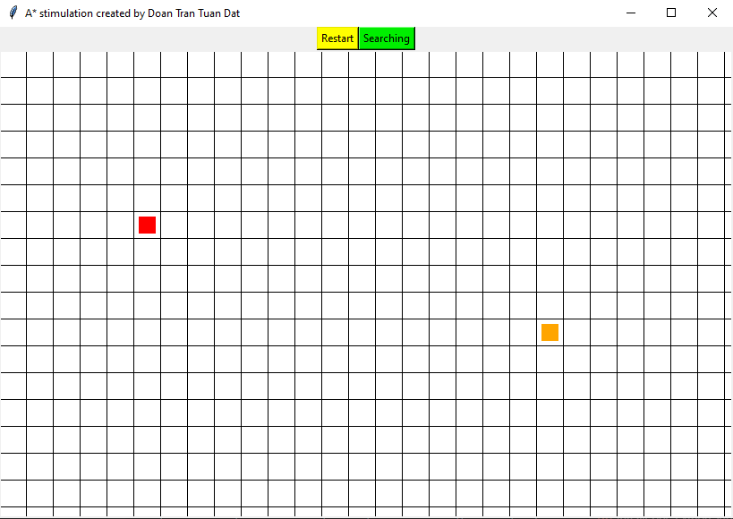

# AI_Basic
Artifical Intelligence
Artifical Intelligence project

Project 1: Algorithm stimulation
Language: Python
BFS and A* Search stimulation

Instruction
Red Cell is Start point.

Orange Cell is End point.

Dragging left click to create blocks Pink cell

Moving Start Point by clicking the Red cell then click again to the other cell.

alt text

alt text

Moving End Point by clicking the Orange cell and click again to the other cell.

alt text

alt text

Press Searching to begin the process

Blue cell mean the cell that algorithm have to pass to reach the end point.

Magenta cell mean the trace from the end point back to the start point.

alt text

Process return True if exits path else return False

alt text

Press Restart to begin new process.
